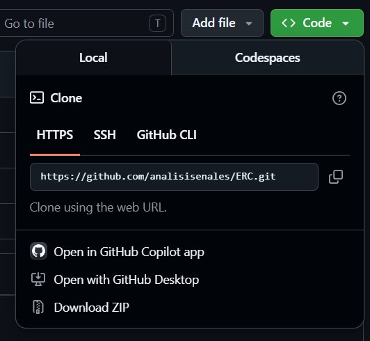
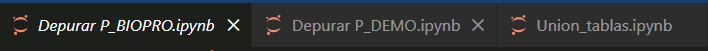
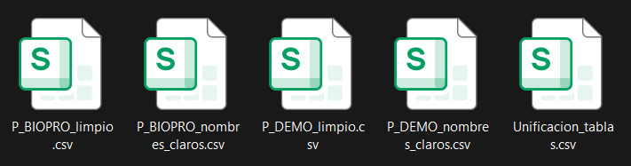

# Discovery of Alternative Biomarkers for Chronic Kidney Disease Using Zero-Leakage Machine Learning Models
**Authores:** Victor Efrain Ramos Rivero, Mauro Emilio Avendaño González, Ing. Jocsan Uziel Martínez López
**Version:** 1.0

<h2 align="center">Descripción del Proyecto</h2>

El presente software constituye una herramienta de apoyo para el análisis de datos biomédicos mediante algoritmos de aprendizaje automático. Su funcionamiento se basa en el procesamiento de una base de datos previamente depurada, utilizando los modelos <b>K-Nearest Neighbors (KNN)</b>, <b>Random Forest</b> y <b>Regresión Logística</b>, con el objetivo de identificar biomarcadores alternativos que favorezcan la detección de la <b>Enfermedad Renal Crónica (ERC)</b>.

### Logotipo

  

---

##  Funciones

- Lectura de conjunto de datos en formato .xpt.
- Genera:
  - **Archivos csv**
      - P_BIOPRO_limpio.csv
      - P_BIOPRO_nombres_claros.csv
      - P_DEMO_limpio.csv
      - P_DEMO_nombres_claros.csv
      - Unificacion_tablas.csv
-Leé estos archivos en los software de **KNN**, **LR**, **RF**
-Genera graficos que nos indican los datos daño renal

##  Ejecución

### **1. Descargar el archivo .ZIP**

  

### **2. Descomprimir el zip y abrir en VS Code**

### **3. Ejecutar los siguientes 3 archivos en orden**

  
   
  Nota: Asegurese de tener los archivos .xpt en el mismo lugar de los ejecutables

  

### **4. Otención de archivos .csv**

  

**Nota:** Cualquier dato o explicación mas al fondo se encuentra dentro del manual de usuario ubicado dentro de cada carpeta correspondiente al idioma

##  Contacto

Para preguntas o colaboraciones, contacte a:

**ra421571@uaeh.edu.mx**

**erikart@uaeh.edu.mx**

**av353745@uaeh.edu.mx**

**uzlopjocmar@gmail.com**
