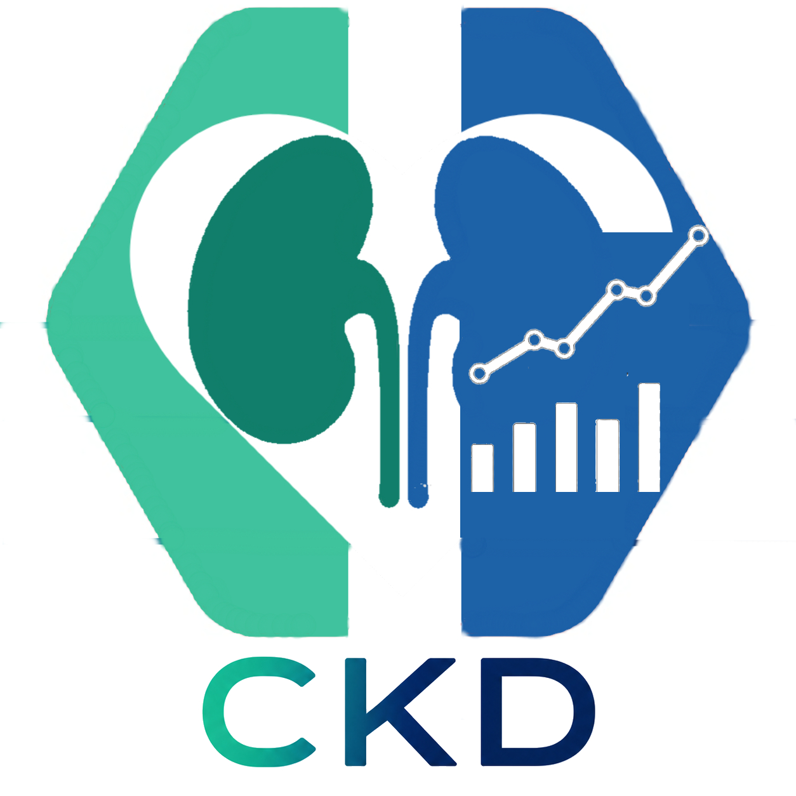

# Discovery of Alternative Biomarkers for Chronic Kidney Disease Using Zero-Leakage Machine Learning Models
**Authores:** Victor Efrain Ramos Rivero, Mauro Emilio Avendaño González, Ing. Jocsan Uziel Martínez López
**Version:** 1.0

<h2 align="center">🧬 Descripción del Proyecto</h2>

El presente software constituye una herramienta de apoyo para el análisis de datos biomédicos mediante algoritmos de aprendizaje automático. Su funcionamiento se basa en el procesamiento de una base de datos previamente depurada, utilizando los modelos <b>K-Nearest Neighbors (KNN)</b>, <b>Random Forest</b> y <b>Regresión Logística</b>, con el objetivo de identificar biomarcadores alternativos que favorezcan la detección de la <b>Enfermedad Renal Crónica (ERC)</b>.

### Logotipo

  

---

## ✨ Features

- Lectura de conjunto de datos en formato .xpt.
- Genera:
  - **Archivos csv**
        